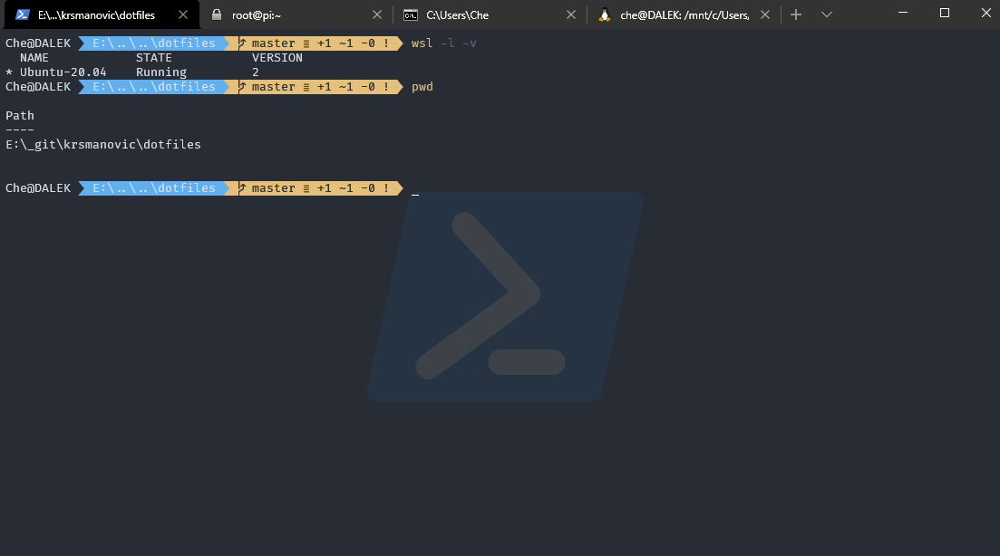

## Windows Terminal configuration



## Setup steps

* Install `Windows Terminal` from Microsoft Store
    - <https://www.microsoft.com/store/productId/9N0DX20HK701>
* Download and install `Fira Code` font with ligatures
    - <https://github.com/tonsky/FiraCode>
* Download and install `Caskaydia Cove Nerd Font Complete` fonts
    - <https://github.com/ryanoasis/nerd-fonts/releases/download/v2.1.0/CascadiaCode.zip>
* Get `Token Light` icon set
    - <https://www.deviantart.com/brsev/art/Token-128429570>
* Copy settings.json and images to application folder:
```
c:\Users\%USERNAME%\AppData\Local\Packages\Microsoft.WindowsTerminal_8wekyb3d8bbwe\
```
* Edit all the `guid` values and paths in the `LocalState/settings.json` to suit your setup

## Note

This guide is to be used together with [PowerShell](../PowerShell) configuration.